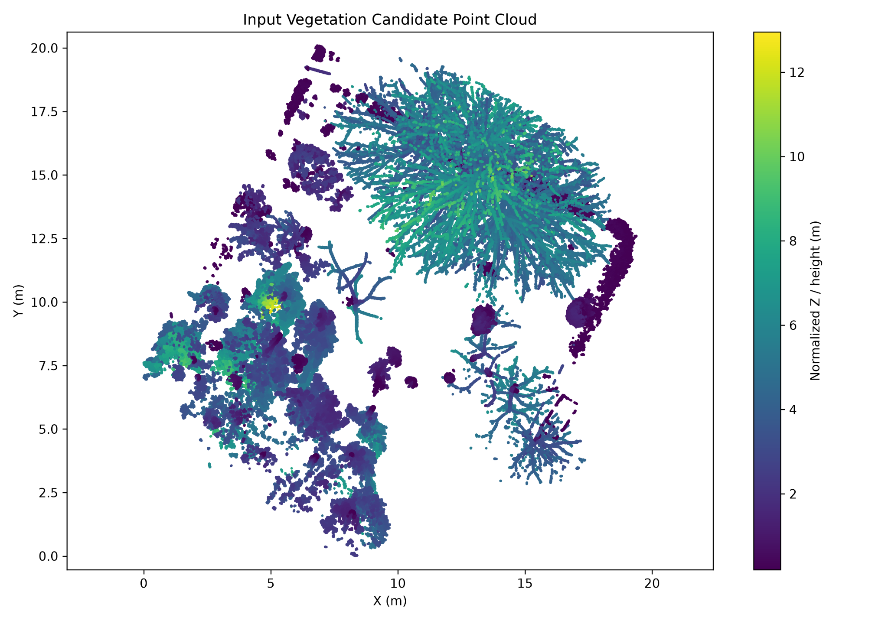
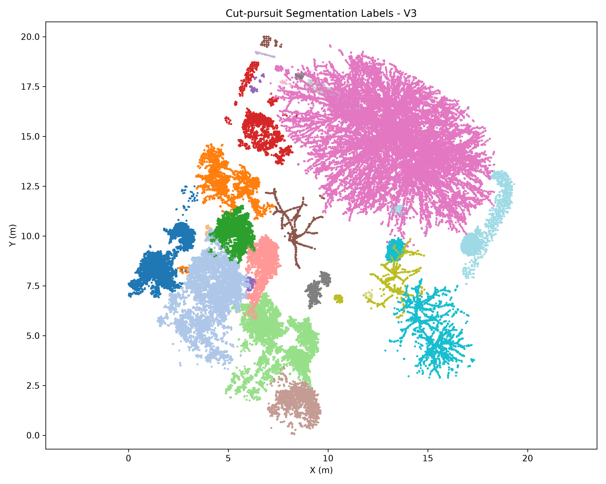
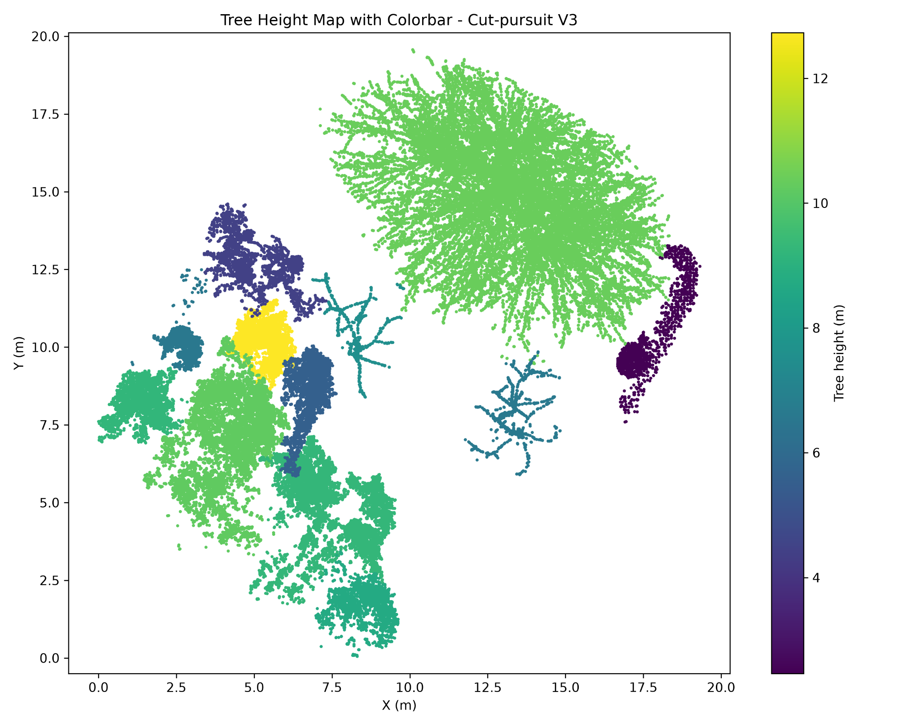
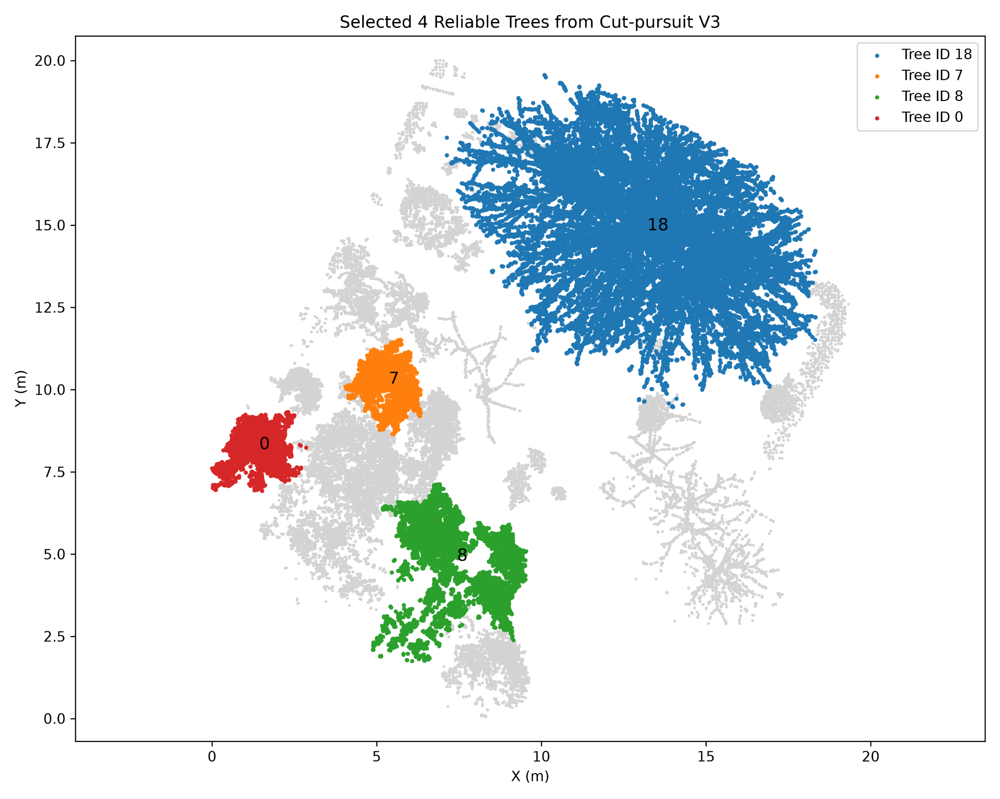
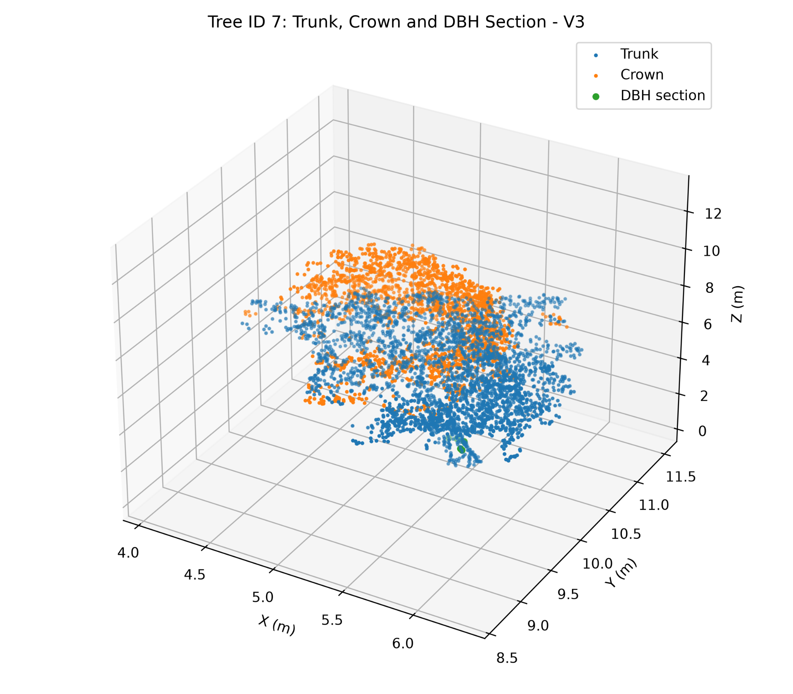
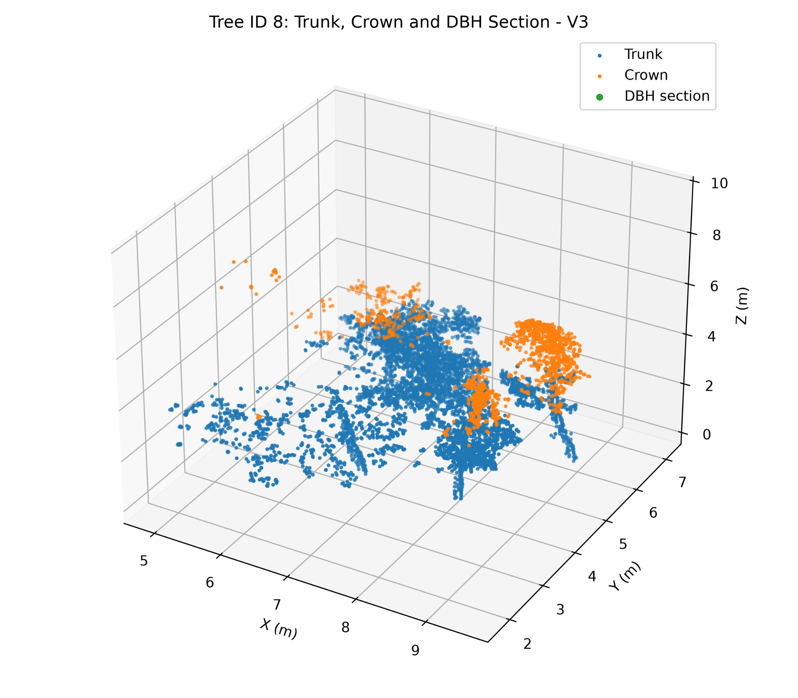
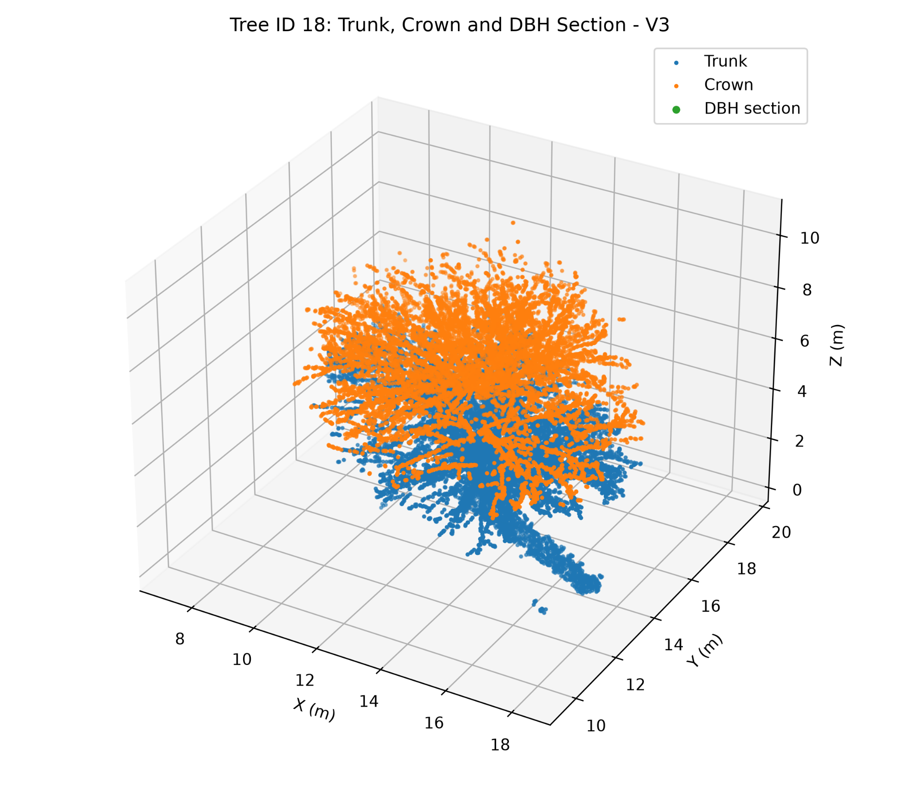

# LiDAR Individual-Tree Segmentation with Cut Pursuit

A reproducible Python project for **individual-tree segmentation** and
**tree-structure metric extraction** from LiDAR vegetation point clouds.

This repository refactors a graduate coursework project into a cleaner,
portfolio-ready codebase with:

- vegetation-point filtering
- voxel-based point-cloud reduction
- Cut Pursuit graph segmentation
- geometric candidate filtering
- quality-based tree selection
- tree-height mapping
- crown / lower-structure separation
- robust DBH estimation
- per-tree structural visualization

The project originated from graduate coursework in **Advanced Laser Scanning:
Processing and Applications** at **K. N. Toosi University of Technology**.

## Workflow

```text
Vegetation LiDAR point cloud
        |
        v
Local coordinate shift
        |
        v
Low-height filter (> 0.20 m)
        |
        v
0.10 m voxel downsampling
        |
        v
XYZ standardization + Z weighting
        |
        v
Cut Pursuit segmentation
        |
        v
Geometric segment metrics
        |
        v
Tree-candidate filtering
        |
        v
Quality ranking + spatial separation
        |
        v
Individual-tree structural metrics
```

## Key Documented Configuration

The documented final configuration used:

```text
minimum height  = 0.20 m
voxel size      = 0.10 m
K neighbors     = 16
regularization  = 2.5
Z weight        = 0.20
```

The final documented run produced:

- **31 initial Cut Pursuit components**
- **12 valid tree candidates after geometric filtering**
- **4 selected reliable trees for detailed structural analysis**

## Python Input Point Cloud

The public portfolio starts from the vegetation-candidate point cloud used by
the Python pipeline.



## Cut Pursuit Segmentation Result

The segmented point cloud below shows the 31 initial components obtained from
the final Cut Pursuit configuration.



## Tree Height Map

The following visualization summarizes per-tree height estimates for the
segmented candidates.



## Selected Reliable Trees

Four spatially separated, high-quality tree candidates were selected for
detailed structural analysis.

**Selected tree IDs: 18, 7, 8, and 0**



## Documented Candidate-Tree Height Statistics

| Statistic | Value (m) |
| --- | ---: |
| Mean | 7.8189 |
| Minimum | 2.4623 |
| Maximum | 12.7309 |
| Standard deviation | 2.8553 |

## Documented Selected-Tree Metrics

| Tree | Height (m) | Crown Width (m) | Crown Base Height (m) | Robust DBH (m) |
| ---: | ---: | ---: | ---: | ---: |
| 18 | 10.4037 | 11.1954 | 4.8565 | 0.6117 |
| 7 | 12.7309 | 2.2285 | 6.7908 | 0.2304 |
| 8 | 9.2804 | 4.3390 | 3.9343 | 0.2160 |
| 0 | 9.2394 | 2.3842 | 5.0716 | 0.2514 |

## 3D Structural Views of Selected Trees

### Tree 7



### Tree 8



### Tree 18



## Robust DBH Estimation

DBH is estimated around **1.30 m local height** using a robust section-based
procedure:

1. estimate an approximate lower-stem center;
2. search progressively wider slices around breast height;
3. cluster the section with DBSCAN when enough points exist;
4. select the cluster closest to the lower-stem center;
5. reject extreme radial distances;
6. estimate diameter from a robust radial percentile.

This reduces sensitivity to branches, canopy points, and isolated outliers in
the breast-height section.

## Important Refactor Corrections

The public version improves the coursework script in several ways.

### Voxel representation

The original code kept the **first point** found inside each occupied voxel.
The refactor uses the **voxel centroid**, making the representative point less
dependent on input point order.

### Height terminology

The original script subtracts the minimum XYZ coordinate of the vegetation
cloud. The resulting Z coordinate is therefore described here as **local
height above the minimum input Z**, rather than assumed terrain-normalized
height.

### Volume metric naming

The coursework reported `CV` and `BCV`. In the original implementation,
however:

- `CV` was the convex-hull volume of crown points;
- `BCV` was calculated from the lower/trunk subset.

Because that second value is not a bounding crown volume, the refactored code
uses explicit metric names:

```text
crown_hull_volume_m3
lower_structure_hull_volume_m3
```

Historical coursework values remain available in the documented-results CSV
for traceability.

## Running the Pipeline

Install dependencies:

```bash
pip install -r requirements.txt
```

Then run:

```bash
python examples/run_tree_segmentation.py vegetation_candidate.las   --output-dir outputs   --min-height 0.20   --voxel-size 0.10   --k-neighbors 16   --regularization 2.5   --z-weight 0.20
```

### Cut Pursuit backend

The exact course-specific `cut_pursuit` backend used for the original run was
not included in the submitted files and is therefore not guessed or vendored
here.

The pipeline expects a compatible Python module exposing:

```python
perform_cut_pursuit(k_neighbors, regularization, features)
```

See `docs/cut_pursuit_backend.md`.

## Tests

Run:

```bash
python -m unittest discover -s tests
```

The test suite covers:

- coordinate localization
- low-height filtering
- centroid voxelization
- Cut Pursuit output-to-label conversion
- backend injection
- feature weighting
- robust DBH estimation on a synthetic cylindrical stem
- explicit volume-metric naming
- documented final parameter/result consistency

## Repository Structure

```text
lidar-individual-tree-segmentation/
├── README.md
├── LICENSE
├── requirements.txt
├── pyproject.toml
├── .gitignore
├── src/
│   └── lidar_tree_segmentation/
│       ├── __init__.py
│       ├── io.py
│       ├── preprocessing.py
│       ├── segmentation.py
│       ├── metrics.py
│       ├── selection.py
│       ├── pipeline.py
│       └── visualization.py
├── examples/
│   ├── run_tree_segmentation.py
│   └── documented_results.py
├── tests/
│   ├── test_preprocessing.py
│   ├── test_segmentation.py
│   ├── test_metrics.py
│   └── test_documented_results.py
├── data/
│   ├── documented_parameter_tests.csv
│   ├── documented_valid_tree_candidates.csv
│   ├── documented_selected_tree_metrics.csv
│   └── documented_summary.json
├── figures/
│   ├── input_vegetation_candidate.png
│   ├── cut_pursuit_segmentation.png
│   ├── tree_height_map.png
│   ├── selected_reliable_trees.png
│   ├── tree_7_structure.png
│   ├── tree_8_structure.png
│   └── tree_18_structure.png
└── docs/
    ├── refactor_notes.md
    ├── documented_results.md
    └── cut_pursuit_backend.md
```

## Reproducibility Scope

The original vegetation LAS file and the exact Cut Pursuit backend are not
redistributed with this repository.

Therefore the repository:

- preserves the real documented Python outputs and numerical results;
- provides a cleaned and testable implementation of the surrounding pipeline;
- does **not** claim that the original segmentation can be rerun without the
  missing input data/backend.

## Research Relevance

This project demonstrates experience with:

- 3D LiDAR point-cloud processing
- voxelization
- graph-based segmentation
- individual-object extraction
- geometric filtering
- robust DBH estimation
- crown structure analysis
- ConvexHull geometry
- PCA-based shape descriptors
- DBSCAN clustering
- tree-height mapping
- reproducible scientific Python workflows

It aligns well with research interests in **point-cloud processing, LiDAR
perception, 3D computer vision, photogrammetry, and geospatial AI**.

## Author

**Reza Pourali**  
M.Sc. Student in Photogrammetry  
K. N. Toosi University of Technology
